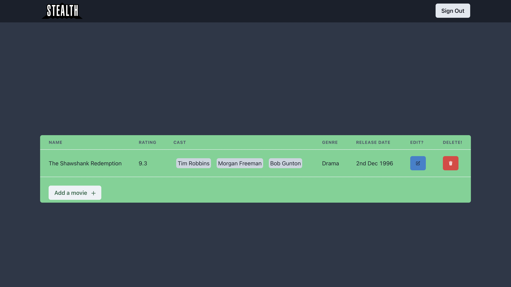
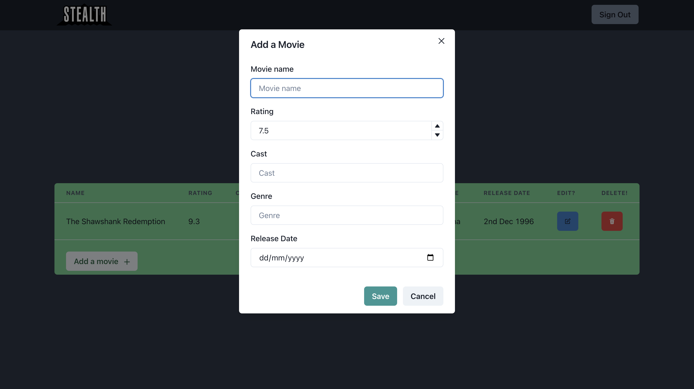
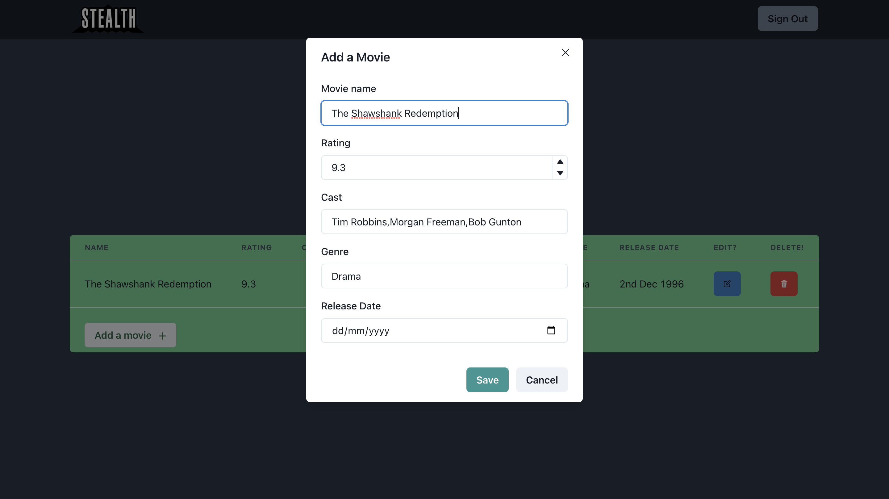
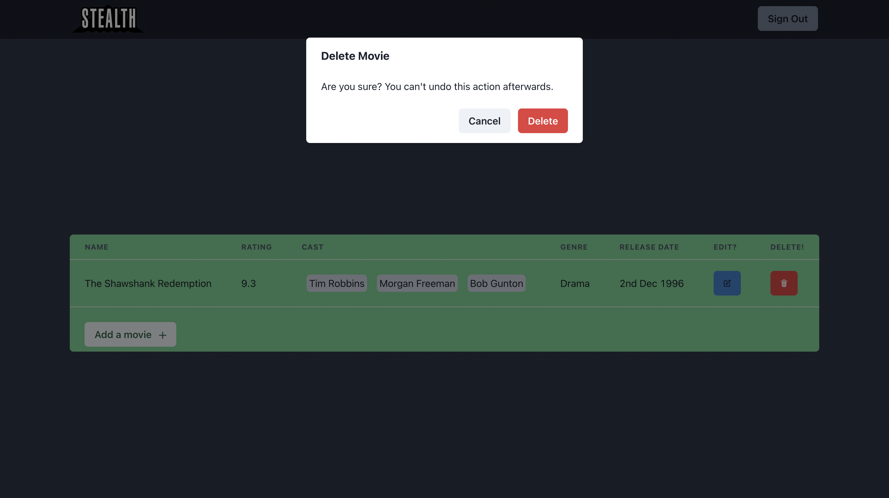
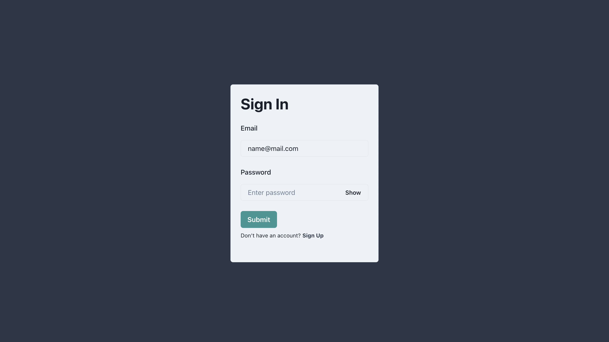
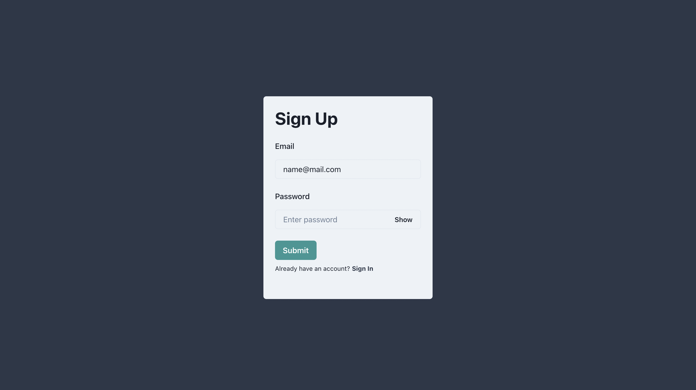

# Stealth

# Tech Stack (Backend)

- Node.js
- PostGreSQL
- Prisma ORM
- Typescript

# Tech Stack (Frontend)

- React
- Formik
- Chakra UI
- Javascript

# How to Run:

- Run Postgres Instance on Prisma

```bash
npx prisma migrate dev
npx prisma studio
```

- Start Server

```bash
cd server
npm install
npm start
```

- Start Client

```bash
cd client
npm install
npm start
```

# [Postman](https://www.postman.com/warped-space-32952/workspace/stealth-test/collection/21982932-a4af736f-45ba-4065-8c4a-34f1cb9ed642?action=share&creator=21982932&ctx=documentation)

# UI Screens

## Home Page



## Add Movie



## Edit Movie



## Delete Alert



## SignIn Page



## SignUp Page


